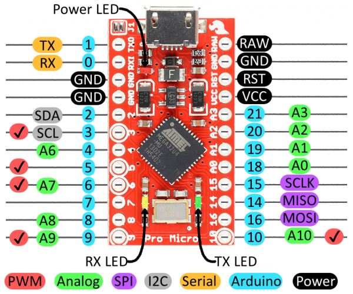
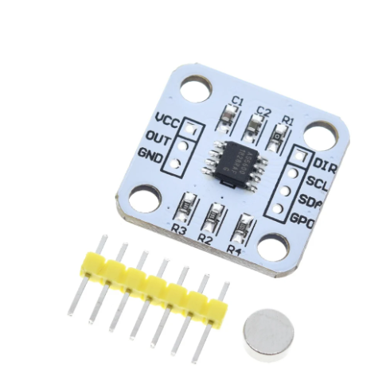
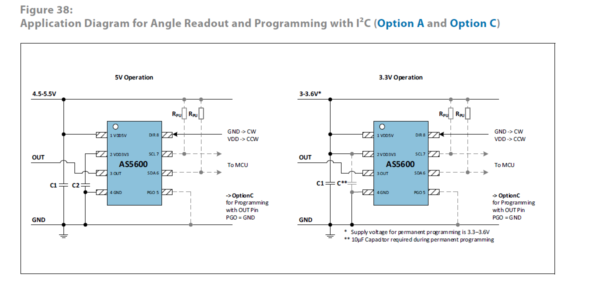
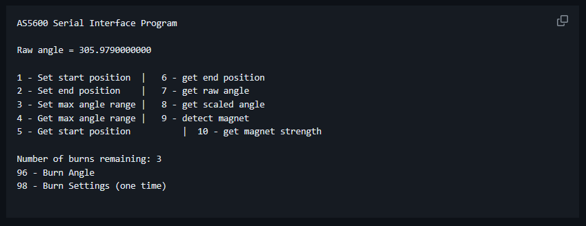

# A320-Gimbal-Joystick
**DIY Gimbal A320 Joystick**

A320 Gimbal Joystick using AS5600 sensor

Gimbal by Olukelo

Joystick by Joker_G

1. Job Set-up Information
    

    **A. 3D Models**

        1. Okulelo Gimbal https://www.thingiverse.com/thing:2496028
        2.  A. AS5600 update for greatest olukelo joystick https://www.thingiverse.com/thing:5874121
            B. AS55600 holder m5 threaded https://www.thingiverse.com/thing:6367969
        3. Sidestick Grip for Virpil Thrustmaster VKB Joysticks https://www.printables.com/model/125176-sidestick-grip-for-virpil-thrustmaster-vkb-joystic/files

    **B. Libraries:**

        1. Joystick library (https://github.com/MHeironimus/ArduinoJoystickLibrary)
        2. AS5600 Serial Interface Program (https://github.com/Seeed-Studio/Seeed_Arduino_AS5600)
        3. AMS AS5600 Data Sheet (https://ams.com/documents/20143/36005/AS5600_DS000365_5-00.pdf/649ee61c-8f9a-20df-9e10-43173a3eb323)
        4. AS5600 Library (https://github.com/RobTillaart/AS5600)

    

    **C. Materials**

        1. COUNTERSUNK BOLT M5x25 QTY AS REQUIRED
        2. COUNTERSUNK BOLT M5x30 QTY AS REQUIRED
        3. COUNTERSUNK BOLT M5x35 QTY AS REQUIRED
        4. COUNTERSUNK BOLT M5x40 QTY AS REQUIRED
        5. M5 NUT QTY AS REQUIRED
        6. ARDUINO PRO MICRO (as HID Game Controller)
        7. AS5600 SENSOR MODULE (WHITE BOARD)
        8. MICRO LIMIT SWITCH
        9. MINI ROUND MOMENTARY PUSH BUTTON SWITCH RED
        10. MF105ZZ x8
        11. 6802ZZ x4
        12. 685ZZ  x4
        13. Breadboard and Jumpers/Dupont Connectors

    **D. References**

        1. ArduinoIDE Library Installation (https://support.arduino.cc/hc/en-us/articles/5145457742236-Add-libraries-to-Arduino-IDE)
2. Job Set-up

    **A. 3D Print**

        1. Okulelo Gimbal (https://www.thingiverse.com/thing:2496028)
        2. AS5600 update for greatest olukelo joystick (https://www.thingiverse.com/thing:5874121)
        3. AS55600 holder m5 threaded (https://www.thingiverse.com/thing:6367969 (Optional))
        

    NOTE: The following are required to be able to Program the Max Angle on the AS5600 sensor to work as an Analog Potentiometer.

    **B. Wiring** 
    
    Ref. to fig. 
    
    

    Ref. to fig. 
    
    

    Ref. to fig. 
    
    

   NOTE: For Convinience, I recommend to solder only the 4 Pin Headers to use dupont connectors only for programmming (DIR,SCL,SDA,PGO). Solder the wires for VCC,OUT and GND. 

   
    1. Remove/Unsolder R1 AND R4 Resistor (for 5v analog OUT/PROGRAMMING)
    2. Using the Breadboard and Jumpers, Hook-up Up the Following PINS:

        - AS5600 VCC Pin to Arduino Pro Micro +5v Pin
        - AS5600 GND Pin to Arduino Pro Micro GND Pin
        - AS5600 SDA Pin to Arduino Pro Micro Pin 2 
        - AS5600 SCL Pin to Arduino Pro Micro Pin 3
        - AS5600 DIR Pin to GND FOR CLOCKWISE (VCC FOR COUNTER CLOCKWISE)
        - AS5600 PGO Pin to GND
      
       NOTE: I had success analog output with wiring DIR Pin to VCC.

4. Procedure

    **A. ASSEMBLE**

        1. Okulelo Gimbal https://www.thingiverse.com/thing:2496028
        2. AS5600 update for greatest olukelo joystick https://www.thingiverse.com/thing:5874121
        3. AS55600 holder m5 threaded https://www.thingiverse.com/thing:6367969 (Optional)
        4. Install the magnets that came with the AS5600 module.

    **B. AS5600 PROGRAMMING**

    NOTE: Perform AS5600 Programming One at a time.

    Ref. to fig. 

        1. Install Seeed_Arduino_AS5600 Library in ArduinoIDE
        2. Upload Groove-AS5600 fullFunction Example (File->Example->Groove-AS5600->fullFunction)      
        3. Open Serial Monitor (Ctrl+Shift+M)
        4. Select Baudrate 115200
        5. Type Command 7 to view your Raw Angle(Current Position)
        6. Move Joystick to MIN of Range
            1. Type Command 7 to view/get Raw Angle 
            2. Type Command 1 to Set start Position
        7. Move Joystick to MAX of Range
            1. Type Command 7 to view/get Raw Angle 
            2. Type Command 2 to Set end Position    
        8. Please read below note before proceeding. Type Command 96 to Burn Angle on sensor.
        9. Unplug USB and Recconnect, Type Command 8 to Verify Scaled Range.
        10. Perform Functional Check, from the MIN to MAX position Incrementaly move your Axis and Type Command 8 per Increment.
        11. Perform Analog Output functional Check via MULTIMETER 
        12. Repeat Steps 3-12 for the other sensor.
        13. Solder the wires for VCC, OUT, GND on the Sensor , Length as required to be connected to Arduino Pro Micro

    **Note: You only have 3 chances to Perform Burn Angle command and a One time chance to Burn Settings.**

    **C. Joystick Library Installation**

        1. Install Joystick Library https://github.com/MHeironimus/ArduinoJoystickLibrary
        2. Download main.cpp
        3. you may modify the code for your specific needs. the code features the whole side console of a320 cockpit mainly for Nose Wheel Steering and Joystick.

    **D. Arduino Pro Micro Wiring**
    
        1. Hook all VCC wires to Arduino Pro Micro +5v VCC Pin
        2. Hook all GND wires to Arduino Pro Micro GND Pin
        3. Assign all PushButton pins to Arduino Pro Micro Digital Pins 
        4. Assign AS5600 OUT Pins to Arduino Pro Micro Analog Input Pins

DISCLAIMER: I am no expert in Arduino Coding nor any programming language. I am barely just only at an Introductory level. I apologize if there are any mistakes in the code, most of it were just dissections of youtube tutorials and other tutorials i find in instructables and examples combined and most of the time I am just guessing with the basis of things from here must match to there.
I created this guide for myself, as i tend to forget most of the things when i jump to my next DIY project. I had to make this to a point that i could still follow even if i forget how to do things as I only learn things as i go when i want to DIY stuff. Hopefully i will retain whatever i learned here.
